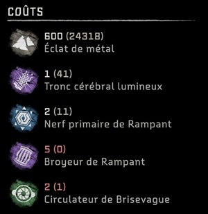
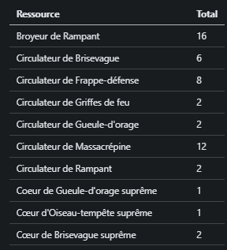

# Equipment upgrades resource calculator - Horizon Forbidden West

Python program that computes total resources needed to fully upgrade a set of equipments (weapons, armors).

## Input parameters

The `dataset` directory is expected to contain screenshots of the `Costs (en)/Coûts (fr)` description of the equipment. This can be found by using a workbench in the game. Here is an example of the expected screenshots:

 

## Description

1. The program extracts the cost descriptions from the provided screenshots. So far 2 text extraction engines can be used:
    - Google Cloud Vision API: create a `.env` file from the `.env.sample` file and specify your API key
    - Google Tesseract OCR: requires installation on your personal workstation (see https://tesseract-ocr.github.io/tessdoc/Installation.html)
2. The program cleans the text extractions
3. The program computes the total cost for each resource (shards are omitted, I assume you will have enough 😉)
4. The program writes the results in the `output/results.md` file



## Execution

```
python -m venv venv
source venv/Scripts/activate
pip install -r requirements.txt
py main.py
``` 