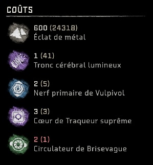

# Equipment upgrades resource calculator - Horizon Forbidden West

Python program that computes total resources needed to fully upgrade a set of equipments (weapons, armors) in the game "Horizon - Forbidden West" (Guerilla Games)

## Input parameters

The `dataset` directory is expected to contain screenshots with the of the equipments, which can be found by using a workbench in the game. Here is an example of what the screenshot must look like:



## Description

1. The program extracts the cost descriptions from the provided screenshots. 2 text extraction engines can be used: 
- Google Cloud Vision
- Tesseract OCR (_still WIP_)

See the prerequisites section for each engine   

2. The program cleans the extracted text
3. The program computes the total cost for each resource (shards are omitted, I assume you will have enough 😉)
4. The program writes the results in the `output/results.md` file. The summary table looks like this:

| Ressource         | Total       |
|-------------------|-------------|
| Ressource 1      | 12     |
| Ressource 2      | 16     |
| ...      | ...     |

## Prerequisites

### If using Google Tesseract OCR engine

The engine must be installed on your personal workstation so the program can execute it (see https://tesseract-ocr.github.io/tessdoc/Installation.html)

## Environment variables

A `.env` file can be created at the root of the project (duplicate the `.env.sample` file). The following variables can be set:
- `GOOGLE_CLOUD_VISION_API_KEY`: API key required only if using this engine
- `EXTRACTION_ENGINE`: either 'google_cloud_vision' or 'tesseract' (optional - will be asked by the program if not provided beforehand)

## Execution

```
python -m venv venv
source venv/Scripts/activate
pip install -r requirements.txt
py main.py
``` 

You will be asked which of the 2 available text extraction engines you want to use. If you select `Google Cloud Vision` you will be asked to provide an API key if none is provided in the `.env` file.