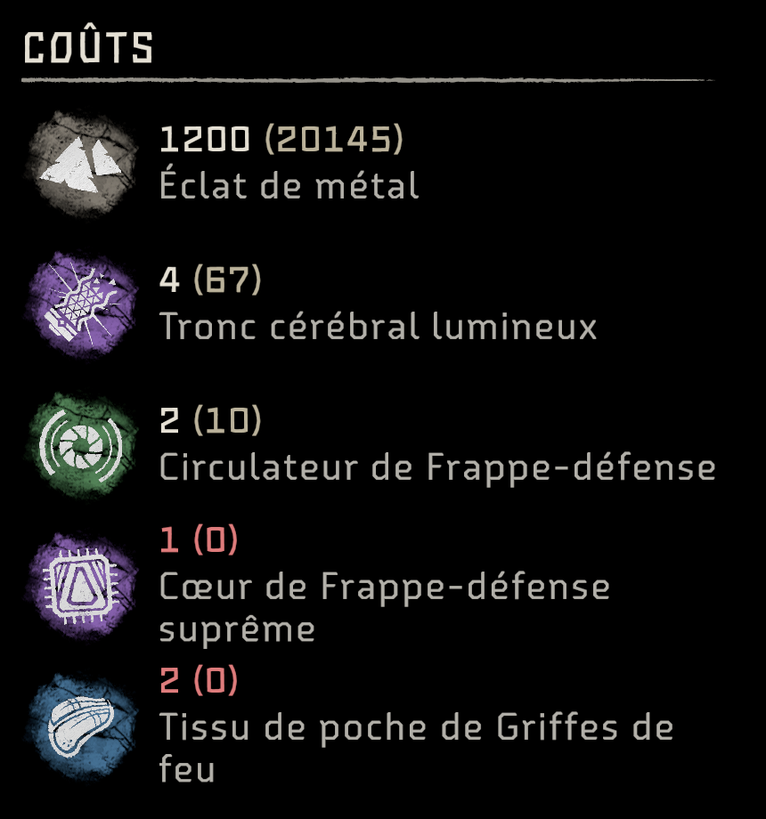

# Equipment upgrades resource calculator - Horizon Forbidden West

Python program that computes total resources needed to fully upgrade a set of equipments (weapons, armors) in the game "Horizon - Forbidden West" (Guerilla Games)

## Input parameters

The `dataset/original` directory is expected to contain screenshots with the upgrade costs of the equipments you want to fully upgrade. To get such screenshots, find a workbench in the game, go to the upgrade page of the equipment and take a screenshot. 

**In order to get better results for the text extraction, save the screenshot in PNG format (you can select the format in the Playstation's screenshot tool settings)** 

Here is a screenshot example:


## Description

1. The program crops every screenshot from the `dataset/original` directory and save the cropped screenshot in the `dataset/cropped` directory. The cropped screenshot looks like this:

2. The program extracts the upgrade costs from cropped screenshots via text extraction techniques. 2 text extraction engines can be used: 
- Google Cloud Vision
- Easy OCR
- Tesseract OCR (_still WIP_)
3. The program cleans up the extracted text so it can be processed easily
4. The program computes the total cost per resource (shards are omitted, I assume you will have enough 😉)
5. The program writes a compilation table with the total costs per resource in a markdown file (see `output/{extraction_engine}/results/total_costs_per_resource.md` file after execution), which looks like this *(in French)*:

| Ressource         | Total       |
|-------------------|-------------|
| Broyeur de Rampant      | 10     |
| Canon cyclonique d'Oiseau-tempête      | 3     |
| Circulateur d'Oiseau-tempête      | 2     |
| Circulateur de Brisevague      | 2     |
| Circulateur de Frappe-défense      | 10     |
| Circulateur de Griffes de feu      | 2     |
| Circulateur de Griffes de gel      | 4     |
| Circulateur de Gueule-d'orage      | 2     |
| Circulateur de Massacrépine      | 16     |
| Circulateur de Rampant      | 2     |
| Coeur de Gueule-d'orage suprême      | 2     |
| Croc métallique de Vulpivol      | 5     |
| Cœur d'Oiseau-tempête suprême      | 2     |

## Prerequisites

### If using Google Tesseract OCR engine

The engine must be installed on your personal workstation so the program can execute it (see https://tesseract-ocr.github.io/tessdoc/Installation.html)

## Environment variables

At the root of the projet tree, duplicate the `.env.sample` file and rename it `.env`. The following variables can be set:
- `GOOGLE_CLOUD_VISION_API_KEY`: API key required only if using this engine (optional - if not specified, you will be asked to provide an API key if you select GCV engine)
- `EXTRACTION_ENGINE`: either 'google_cloud_vision', 'tesseract_ocr' or 'easy_ocr' (optional - if not specified, will be asked by the program)

## Execution

Run the following command to execute the program:
```shell
python -m venv venv 
source venv/Scripts/activate
pip install -r requirements.txt
py main.py
```